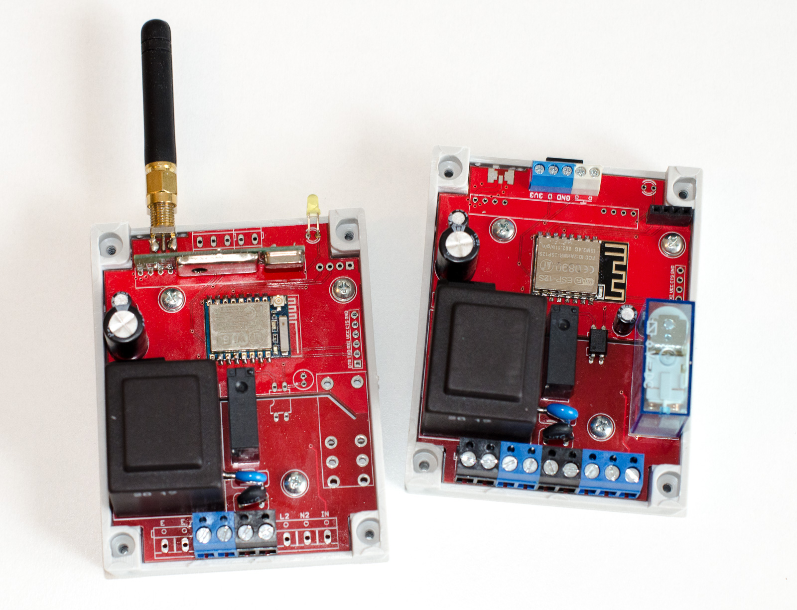

# ESP8266 DIN mount relay
ESP8266 DIN mount relay *(DPDT@10A and SPST-NO@5A)* board with 433mHz RF receiver or generic input 230VAC or DC (based on jumper and resistor) and temperature sensor (DS18B20 or DHT22). Power supply is good old fashioned style transformer so no noise generated - **radioamateur friendly**. I2C/two ins are accesible on 2.54mm header, for you to extend capabilities.

Board features auto reset with set of GPIO0 LOW when uploading firmware via FTDI so you don't have to press any button to jump into program mode.

## Picture

*Please note that this is picture of v1.0 which in not available in this repo, I have updated the project to v1.1 which fixes some bugs and adds RC filter for relays*

## BOM
### Minimal components

| Qty | Component | Value | Package |
|:---:| --------- | ----- | ------- |
| 3 | Capacitor | 100n | 0805 |
| 1 | Capacitor | 100uF/16V |  Ø5mm, grid 2.032mm |
| 1 | Capacitor | 1000uF/16V | Ø10mm, grid 5mm |
| 2 | Capacitor | R463I24705001K | 18x5x11mm |
| 1 | Diode bridge | KBP307 | |
| 1 | Shottky diode | BAT54S | SOT23 |
| 2 | Diode | S1B | DO214AC (SMA) |
| 1 | Thermal fuse | 2A/115°C | |
| 1 | Fuse | TE5 500mA | TE5 |
| 1 | DPDT relay | 44.62.9.006.0000 | |
| 1 | SPST-NO relay | HF46F/005-HS1 | |
| 1 | LED | green | 3mm |
| 2 | Resistor | 1K | 0805 |
| 3 | Resistor | 4K7 | 0805 |
| 4 | Resistor | 10K | 0805 |
| 4 | Resistor | 160R | 2010 |
| 1 | Resistor | 820R | 0805 |
| 1 | Varistor | S07K275 | |
| 2 | NPN transistor | BC817 | SOT23 |
| 1 | Transformer | BV-EI-305-2050 EI30-1 | |
| 1 | Wifi module | ESP8266-12 | |
| 1 | LDO regulator | LM1117-3.3 | SOT223 |
| 3 | Screw terminal | KF301-5.08-2P | |
| 1 | Screw terminal | KF301-5.08-3P | |
| 1 | Screw terminal | KF350-3.5-2P | |
| 1 | Screw terminal | KF350-3.5-3P | |
| 1 | DIN case | Z100J PS | |

### If RF is required
*RF and IN can't work simultaneously*

| Qty | Component | Value | Package |
|:---:| --------- | ----- | ------- |
| 1 | RF reciever | RXB6 | |
| 1 | Capacitor | 100n | 0805 |
| 1 | Capacitor | 0.47uF | SMA |
| 1 | Capacitor | 10uF | SMA |
| 1 | Antenna conenctor | | SMA or u.fl connector |

### If IN is required
*RF and IN can't work simultaneously*

| Qty | Component | Value | Package |
|:---:| --------- | ----- | ------- |
| 1 | Diode | SL1M | SOD123 |
| 1 | Opto-coupler | TLP185 | SOP04 |
| 1 | Resistor | 0R | 2010 |
| 1 | Resistor | 200K | 2010 |
| 1 | Resistor | 10K | 0805 |
| 1 | Capacitor | 100n | 0805 |
| 1 | Capacitor | 100uF/16V |  Ø5mm, grid 2.032mm |

